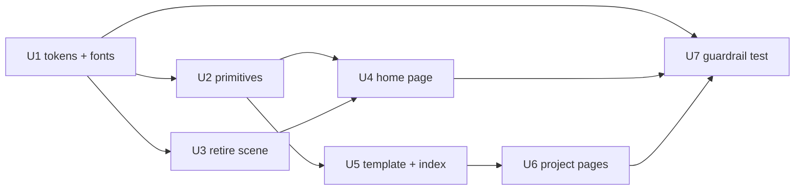

# refactor: Retheme masonstevens.dev to the Broadside brand

## Summary

Replace the site's orchard/forest visual identity with the locked **Broadside** brand system — flat `#EEECE4` stock, two inks, condensed uppercase display type, double rules, engraving hatch, letterpress grain — across every surface. The Three.js scene, cricket ambient audio, and three-stage parallax narrative are retired rather than restyled, because the brand's central claim is that each surface is a printed object and the spareness *is* the identity. Content stays what it is: a software portfolio, styled as a broadside.

---

## Problem Frame

The site currently ships two identities in direct conflict.

The **brand kit** (`~/AI-OS/brand-assets/brand-kit.md`, locked 2026-09-03 after three separate explorations) specifies Broadside: civic political-economy print, two inks on stock, deliberately spare. Its standing decisions are explicit — no gradients, no drop shadows, no editorial serifs, no third hue, spruce never as a large fill, default to light. `brand-assets/AGENTS.md` names `masonstevens.dev` as a consumer of that identity and says directly: *"the site should be a broadside, not a themed UI"* and *"Default to light... Ship [dark] only if there is a real reason, not reflexively."*

The **site** (rethemed 2026-05-21, shipped on `feat/portfolio-nature-retheme`) is the near-exact inverse: dark `--orchard-*` palette, Fraunces variable serif display, `backdrop-blur` frosted cards with `shadow-lg` and `rounded-3xl`, a 915-line Three.js firefly/pine/underground scene, `crickets.wav` ambient audio, mouse parallax, and a scroll-tied stage narrative with color-lerped vignettes.

Every single locked prohibition is violated by the current implementation. This is not drift that can be patched — the orchard theme is a coherent system that has to be removed as a system.

The retheme is also four months newer than the work it replaces. That is the point: Broadside is the later, deliberate lock, and it was locked *after* the orchard theme shipped.

---

## Requirements

- R1. Every rendered surface uses the Broadside palette: stock ground `#EEECE4`, ink `#17140F`, spruce accent `#0E4A45` / `#093430`. No `--orchard-*` token survives in `src/`.
- R2. Display type is condensed, uppercase, demibold, tracked — `Avenir Next Condensed` locally with `Barlow Semi Condensed 600` loaded from Google Fonts so it resolves for visitors. Body is a system grotesque. Figures are tabular.
- R3. The locked prohibitions hold site-wide: no gradients, no drop shadows, no border-radius as decoration, no editorial serifs, no third hue, no large spruce fills.
- R4. Structural devices are present and load-bearing, not ornamental: double rules (5px + 2px, 3px apart), `ARTICLE I/II/III` section numbering, `PLATE` captions, the motto line, letterpress grain.
- R5. The Three.js scene, ambient audio, stage-scroll machinery, and scroll/mouse parallax are removed, along with the dependencies that only they used.
- R6. Site content and IA are unchanged — same routes, same eleven project pages, same featured work. This is an identity replacement, not a product change.
- R7. Existing behaviour that is not visual keeps working: Module Federation remotes (`calculators`), embedded iframes, VoiceGarden's audio-driven canvas, SingleLineDrawer, the error boundaries, and the calculators offline/crash fallbacks.
- R8. The prohibitions are enforced by something other than memory, so the next component does not quietly reintroduce a shadow.

---

## Scope Boundaries

- Not a content or IA change. No new sections, no land/housing/build-plan content, no copy rewrite beyond a voice pass on the home page blocks.
- Not a repositioning. The site stays a software portfolio; it is styled with the brand, not converted into the brand's publication. (Explicitly chosen 2026-09-08 over a "brand hub with a work section" framing.)
- No theming of the separately deployed microfrontend remotes (`calculators`, `picture-to-pixel-art`) or embedded third-party iframes (`yarden.diy`). Those own their own styling and deploy independently. Only the host shell around them is themed.
- No dark variant. The commented dark block in `web-tokens.css` stays commented, per the kit.
- No new test infrastructure (jsdom, `@testing-library/react`). The repo tests pure functions in a node environment; the guardrail in U7 is written to fit that, not to expand it.

### Deferred to Follow-Up Work

- Retiring the Redux store entirely: after U4 the `globalDataSlice` `headerSelected` state has no consumer, but the `Provider` in `src/main.tsx` and the store scaffolding are cheap to leave in place. Remove in a separate pass once nothing else claims them.
- Restyling the deployed `calculators` and `picture-to-pixel-art` remotes to match. Separate repos, separate deploys.
- A brand-styled `PLATE`-caption treatment for SketchUp plan sheets on the site. No plan-sheet content exists here yet.

---

## Context & Research

### Brand sources (external to this repo)

| File | What it gives this plan |
|---|---|
| `~/AI-OS/brand-assets/brand-kit.md` | Spec of record. Palette table, type roles, structural devices, wordmark. Everything defers to this. |
| `~/AI-OS/brand-assets/web-tokens.css` | CSS custom properties and primitives already extracted for web. The starting point for U1. |
| `~/AI-OS/brand-assets/comp-broadside-locked.html` | The locked comp. Working reference for masthead, `ARTICLE` heads, bordered grids, `PLATE` caption + title block, bill-of-materials table. |
| `~/AI-OS/brand-assets/AGENTS.md` | Application guidance, incl. the font-resolution warning and the `--red`→`--spruce` rename. |
| `~/AI-OS/brand-assets/positioning.md` | Voice: analytical, compassionate, direct, grounded. Used for the home-page copy pass only. |

These live outside this repository. U1 vendors the token layer into `src/` with a provenance header rather than reaching across the filesystem at build time.

### Relevant code and patterns

- `portfolio-website/src/index.css` — the single `:root` token block. One file to swap; the retheme's own design doc established this as the source of truth, and that structure is worth keeping.
- `portfolio-website/index.html` — Google Fonts `<link>` for Fraunces + Lato. Same mechanism, different families.
- `portfolio-website/src/pages/ProjectPageTemplate.tsx` — every project page and the projects index wrap in this. Themeing it once propagates to twelve pages.
- `portfolio-website/src/components/home/` — six blocks, all `ParallaxLayer`-based, all carrying frosted-card styling.
- `portfolio-website/src/utils/hooks/` — scene hooks are cleanly isolated: `useThreeSceneMount`, `useMouseParallax`, `useParallaxScroll`, `useScrollListen`, `useStageScroll`, `useAmbientSound`, `useHeaderSelectionListener` are consumed *only* by the home page. VoiceGarden's audio/canvas hooks (`useAudioFrequency`, `useInitializeCanvasBackground`, `useUpdateCanvasFromFrequency`, `useAnimateGardenFromFrequency`, `useUpdateGardenFromFrequency`) are independent and stay.
- `portfolio-website/vitest.config.ts` — standalone node-environment config, deliberately not extending `vite.config.ts` so federation doesn't fetch live remotes during tests. Existing tests are pure-function only.

### Dependency findings

Removable once the scene goes (each verified to have exactly one consumer group):

| Package | Only used by |
|---|---|
| `three` + `@types/three` | `useThreeSceneMount.tsx` |
| `@react-spring/parallax` | the six home blocks |
| `react-chrono` | `ProfessionalGoalsBlock.tsx` (already disabled in the header nav) |

Already dead today, unrelated to this work but free to drop in the same pass: `react-scroll-parallax`, `ldrs` — neither is imported anywhere in `src/`.

### Prior art in this repo

`docs/superpowers/specs/2026-05-21-portfolio-nature-retheme-design.md` is the design doc for the theme being replaced. It is a good model for what a complete theme swap has to touch — palette, type, scene, audio, every card — and its file inventory is still accurate. Read it as a checklist of surfaces, not as a direction.

---

## Key Technical Decisions

- **Vendor the token layer, don't import it.** `web-tokens.css` lives in `~/AI-OS/`, outside this repo and outside Vite's root. Copy it to `portfolio-website/src/styles/broadside.css` with a header naming `brand-kit.md` as spec of record and the copy date. A stale copy is a smaller problem than a build that depends on an unversioned path on one machine.

- **Retire the scene rather than reinterpret it.** A wireframe-in-ink Three.js scene would preserve the craft signal, but the kit's premise is a printed object, and an animated background is the "themed UI" `AGENTS.md` names as the failure mode. Deleting it also removes ~1,000 lines and three dependencies. (Chosen 2026-09-08 over "reinterpret in ink" and "keep as an easter egg".)

- **Rebuild the home page as document flow, not parallax.** `@react-spring/parallax` positions four absolutely-placed layers over a fixed canvas. With no canvas there is nothing to parallax against, and a broadside is a page you read top to bottom. Nav becomes anchor scrolling to `ARTICLE` sections, which also removes the Redux round-trip for `headerSelected`.

- **Structural devices carry the identity, not color.** Two inks on stock is not enough on its own to read as Broadside — a plain black-on-white page reads as unstyled. The double rules, `ARTICLE` numbering, hard 4px borders, `PLATE` captions, and grain are what make it a broadside. U2 builds them as primitives first so every later unit composes them rather than reinventing them.

- **Enforce prohibitions with a source-text test.** The standing decisions are the kind of thing that erodes one component at a time. A vitest that reads `src/**` and fails on `orchard`, `backdrop-blur`, `shadow-`, `linear-gradient`, `rounded-`, and Fraunces/Lato references runs in the existing node environment with no new dependencies, and turns "do not relitigate" into a build failure.

- **Keep `PageWrapper`'s framer-motion fade.** A 0.4s opacity/translate route transition is not a gradient, a shadow, or a themed UI — it is page turn feel. `framer-motion` stays; it is also used by `App.tsx`'s `AnimatePresence`.

---

## Open Questions

### Resolved during planning

- *Scope — launch page or whole site?* Whole site. A broadside home page in front of orchard-dark project pages would make the seam the most visible thing about the site.
- *Does the Three.js scene survive in some form?* No. Retired entirely, with its dependencies.
- *Does the site become the brand's publication?* No. Software portfolio, brand-styled. Content unchanged.
- *Can `web-tokens.css` be imported directly?* No — it is outside the Vite root and outside this repo. Vendored copy with provenance.
- *Do the VoiceGarden audio hooks get caught in the audio removal?* No. `useAmbientSound` is home-page-only; VoiceGarden's frequency and canvas hooks are a separate stack with a separate consumer.
- *Do component tests need jsdom?* No, and adding it is out of scope. The guardrail is a source-text test in the existing node environment.

### Deferred to implementation

- Whether `ProfessionalGoalsBlock` returns at all. It is already commented out of `HEADER_LABELS` and is the only `react-chrono` consumer. U4 decides between rebuilding it as a plain `ARTICLE` section and deleting it — the answer depends on whether the copy still reads as true once it is out of a timeline widget.
- The exact grain implementation. The comps use a fixed overlay at `opacity: .5; mix-blend-mode: multiply` with an image the comp inlines. Whether that ports as an inline SVG noise `data:` URI, a small PNG in `public/assets/`, or a CSS-only stipple is a look-at-it-in-the-browser call.
- Whether the profile photo stays photographic or gets a halftone/hatch treatment. Photography sits oddly in a two-ink system; the fix might be a duotone filter, a 45° hatch overlay, or simply a hard 4px ink border and leaving it alone.
- What the masthead's motto and overline actually say. The brand's motto is *"The land belongs to all of us."* and its overline is *Land · Housing · Political Economy* — both belong to the writing side of the brand, and neither is true of a software portfolio. The visual system transfers cleanly; that one line does not. Options are a software-side line in the same register, the `estd` line alone with no motto, or keeping the brand motto and accepting that the site declares a position unrelated to its contents. U4 has to pick one, and it is the single most visible line on the page.
- Per-page `PLATE` numbering scheme across the eleven project pages — sequential across the site, or per-section. Only meaningful once the pages are in front of you (the kit says numbering is used *only where order is real*, never as decoration).

---

## High-Level Technical Design

> *This illustrates the intended approach and is directional guidance for review, not implementation specification. The implementing agent should treat it as context, not code to reproduce.*

Home page shape after U4 — a single scrolling broadside, no fixed canvas, no parallax layers:

```
┌─ nav (sticky, stock ground, ink bottom rule) ─────────────────┐
│  WELCOME · ABOUT · WORK · CONTACT        (uppercase, tracked) │
├───────────────────────────────────────────────────────────────┤
│                                                               │
│         SOFTWARE · TOOLS · INTERFACES      ← overline, spruce  │
│                                                               │
│              M A S O N   S T E V E N S     ← display, 13vw    │
│                                                               │
│         "…motto line…"                     ← spruce, tracked  │
│         WINSTON-SALEM, N.C. · NO. 1        ← estd line         │
│                                                               │
│  ══════════════════════════════════════════  ← double rule    │
│  ─────────────────────────────────────────                    │
│                                                               │
│  ARTICLE I   ABOUT                         ← spruce + display │
│  ┌───────────┬─────────────────────────┐   ← 4px ink borders  │
│  │  photo    │  body grotesque, 42ch   │                      │
│  └───────────┴─────────────────────────┘                      │
│                                                               │
│  ARTICLE II  SELECTED WORK                                    │
│  ┌─────────┬─────────┬─────────┐          ← plate grid,       │
│  │ PLATE I │PLATE II │PLATE III│            shared 4px rules  │
│  ├─────────┼─────────┼─────────┤                              │
│  │ title   │ title   │ title   │          ← title block per   │
│  │ role·yr │ role·yr │ role·yr │            comp's .tblock    │
│  └─────────┴─────────┴─────────┘                              │
│                                                               │
│  ARTICLE III CONTACT                                          │
│                                                               │
│  ══════════════════════════════════════════                   │
└───────────────────────────────────────────────────────────────┘
   + fixed grain overlay, multiply, non-interactive
```

Unit dependency graph:



---

## Implementation Units

- U1. **Broadside token layer and font loading**

**Goal:** Replace the orchard token system with the brand's, and make the display face actually resolve for visitors.

**Requirements:** R1, R2, R3

**Dependencies:** None

**Files:**
- Create: `portfolio-website/src/styles/broadside.css`
- Modify: `portfolio-website/src/index.css`
- Modify: `portfolio-website/index.html`

**Approach:**
- Copy `~/AI-OS/brand-assets/web-tokens.css` into `src/styles/broadside.css`. Add a header comment naming `~/AI-OS/brand-assets/brand-kit.md` as spec of record, the copy date, and the rule that if the two disagree, the kit wins. Keep the commented dark-mode block commented.
- Do **not** carry the `--red` / `--red-deep` legacy aliases across. They exist so the old comps keep rendering; new work uses `--spruce`, and omitting them makes the wrong name unavailable rather than merely discouraged.
- `src/index.css` imports `./styles/broadside.css` after the Tailwind import, drops all six `--orchard-*` declarations, and flips `color-scheme: dark` → `light`.
- Replace the two-layer radial-dot `body::after` with the letterpress grain: fixed, `inset: 0`, `pointer-events: none`, `mix-blend-mode: multiply`, roughly `opacity: 0.5`. See the deferred question on implementation medium.
- `index.html`: swap the Fraunces + Lato Google Fonts link for `Barlow+Semi+Condensed:wght@600`. Keep the `preconnect` pair. The display stack orders `"Avenir Next Condensed"` first so it wins locally and Barlow catches everyone else — the failure this prevents is a site that looks right in local preview and wrong in production.
- Remove the `h1,h2,h3,h4,.display { font-family: "Fraunces" }` rule; display type comes from the `.display` primitive in U2, and no editorial serif appears anywhere.

**Patterns to follow:**
- `~/AI-OS/brand-assets/web-tokens.css` — token names, metric values, primitive class names.
- The existing `:root`-block-as-single-source-of-truth structure in `src/index.css`.

**Test scenarios:**
- Test expectation: none — pure token and asset-loading change, no behaviour. Verified visually and by U7's guardrail.

**Verification:**
- `npm run dev` renders every page on a stock ground with ink text; nothing is dark.
- With Avenir Next Condensed disabled locally, headings still render condensed (Barlow resolved, not a fallback grotesque).
- `grep -r "orchard" portfolio-website/src/index.css` returns nothing.

---

- U2. **Broadside primitive components**

**Goal:** Build the structural devices once, as components, so every later unit composes them instead of hand-rolling rules and labels.

**Requirements:** R3, R4

**Dependencies:** U1

**Files:**
- Create: `portfolio-website/src/components/broadside/Rule.tsx`
- Create: `portfolio-website/src/components/broadside/DoubleRule.tsx`
- Create: `portfolio-website/src/components/broadside/Masthead.tsx`
- Create: `portfolio-website/src/components/broadside/SectionHead.tsx`
- Create: `portfolio-website/src/components/broadside/PlateCaption.tsx`
- Create: `portfolio-website/src/components/broadside/TitleBlock.tsx`
- Create: `portfolio-website/src/components/broadside/Grain.tsx`
- Create: `portfolio-website/src/components/broadside/index.ts`

**Approach:**
- `Rule` takes `weight: "heavy" | "thin"` and `ink: "black" | "spruce"`. `DoubleRule` composes two with the 3px gap. These are the load-bearing divider; nothing else should draw a border-bottom to separate sections.
- `SectionHead` takes an article numeral and a title, and renders the comp's `.sec-head` shape: spruce uppercase `ARTICLE III` label baseline-aligned against a condensed display title. It also owns the anchor `id` that nav links target, so section identity and section heading stay in one place.
- `Masthead` renders overline / wordmark / motto / estd line, all centered, per `.mast` in the locked comp.
- `TitleBlock` is the comp's `.tblock`: an ink top border with a display title and spruce subtitle on the left, tabular meta right-aligned. It is what makes a project card read as a plate rather than a storefront tile.
- `Grain` is the fixed multiply overlay, rendered once at app root rather than per page.
- Everything takes `className` for layout composition but owns its own type, color, and rule treatment. Callers position; primitives style.

**Patterns to follow:**
- `~/AI-OS/brand-assets/comp-broadside-locked.html` — `.mast`, `.sec-head`, `.doublerule`, `.plate-cap`, `.tblock`, `.grain`.
- Existing component file convention in `src/components/` — named exports, one component per file, leading comment naming the file.

**Test scenarios:**
- Test expectation: none — presentational components with no logic, and the repo has no DOM test environment (see Scope Boundaries). Behaviour worth asserting here is covered by U7's source-text guardrail; correctness is visual.

**Verification:**
- A scratch route or Storybook-less dev page renders all seven primitives; double rules measure 5px/3px/2px, labels track at `0.16em`, display sits at `0.84` leading.
- No primitive emits a `box-shadow`, `border-radius`, or gradient.

---

- U3. **Retire the Three.js scene, ambient audio, and scroll machinery**

**Goal:** Delete the orchard-era interactive layer and the dependencies only it used.

**Requirements:** R5, R7

**Dependencies:** U1

**Files:**
- Delete: `portfolio-website/src/utils/hooks/useThreeSceneMount.tsx`
- Delete: `portfolio-website/src/utils/hooks/useThreeSceneMount.test.ts`
- Delete: `portfolio-website/src/utils/hooks/useMouseParallax.tsx`
- Delete: `portfolio-website/src/utils/hooks/useMouseParallax.test.ts`
- Delete: `portfolio-website/src/utils/hooks/useStageScroll.ts`
- Delete: `portfolio-website/src/utils/hooks/useStageScroll.test.ts`
- Delete: `portfolio-website/src/utils/hooks/useParallaxScroll.tsx`
- Delete: `portfolio-website/src/utils/hooks/useScrollListen.tsx`
- Delete: `portfolio-website/src/utils/hooks/useAmbientSound.tsx`
- Delete: `portfolio-website/src/utils/hooks/useHeaderSelectionListener.tsx`
- Delete: `portfolio-website/src/components/home/SceneVignette.tsx`
- Delete: `portfolio-website/src/components/home/InfiniteScrollContainer.tsx`
- Delete: `portfolio-website/src/utils/types/ParallaxProps.ts`
- Delete: `portfolio-website/src/utils/headerToPageMap.ts`
- Delete: `portfolio-website/public/assets/crickets.wav`
- Modify: `portfolio-website/src/pages/HomePage.tsx`
- Modify: `portfolio-website/package.json`

**Approach:**
- Deletions are safe in this order because the consumers are all inside `src/components/home/` and `src/pages/HomePage.tsx`, which U4 rewrites. Land U3 and U4 together if leaving the tree non-compiling between commits is unacceptable; otherwise let `HomePage.tsx` render a bare placeholder for one commit.
- Drop `three`, `@types/three`, `@react-spring/parallax`, and `react-chrono` from `package.json`. Also drop `react-scroll-parallax` and `ldrs` — both are already unimported today.
- **Do not** touch VoiceGarden's stack. `useAudioFrequency`, `useInitializeCanvasBackground`, `useUpdateCanvasFromFrequency`, `useAnimateGardenFromFrequency`, `useUpdateGardenFromFrequency`, and `drawPlant` belong to `src/components/VoiceGarden/VoiceGarden.tsx` and are unrelated to the home scene. This is the one place a broad "remove the audio hooks" sweep would break a working project page.
- Leave `src/redux/` and the `Provider` in `src/main.tsx` alone (see Deferred to Follow-Up Work). `globalDataSlice` loses its consumer in U4 but removing the store is a separate concern.

**Execution note:** Run the suite before deleting the three test files, and note which assertions were protecting real regressions — `useThreeSceneMount.test.ts` documents a React 19 StrictMode double-mount bug. That knowledge is worth preserving in the commit message even though the code it guarded is gone.

**Patterns to follow:**
- `vitest.config.ts`'s comment about staying in a node environment — after these deletions, `errors.test.ts` is the only remaining test until U7 adds one. Confirm the config still makes sense with that inventory.

**Test scenarios:**
- Happy path: `npm run test` passes with the scene tests removed and `errors.test.ts` still green.
- Happy path: `npm run build` succeeds — `tsc -b` proves no dangling imports to any deleted module.
- Integration: `/projects/voice-garden` still initialises its canvas and responds to microphone input; the VoiceGarden hooks were untouched.
- Integration: `/projects/calculators` still loads the federated remote — the removed deps are unrelated to federation, and the shared-React config in `vite.config.ts` is unchanged.
- Edge case: no request for `/assets/crickets.wav` appears in the network panel on any route.

**Verification:**
- `grep -rn "three\|@react-spring/parallax\|react-chrono\|crickets" portfolio-website/src portfolio-website/package.json` returns nothing.
- `npm ci && npm run build` succeeds from a clean `node_modules`, confirming the dropped packages were genuinely unused.

---

- U4. **Rebuild the home page as a broadside**

**Goal:** Replace the four parallax layers and the floating nav with a single scrolling broadside document.

**Requirements:** R1, R2, R3, R4, R6

**Dependencies:** U2, U3

**Files:**
- Modify: `portfolio-website/src/pages/HomePage.tsx`
- Modify: `portfolio-website/src/components/home/Header.tsx`
- Modify: `portfolio-website/src/components/home/WelcomeBlock.tsx`
- Modify: `portfolio-website/src/components/home/AboutMeBlock.tsx`
- Modify: `portfolio-website/src/components/home/FeaturedWorkBlock.tsx`
- Modify: `portfolio-website/src/components/home/ContactBlock.tsx`
- Delete or rebuild: `portfolio-website/src/components/home/ProfessionalGoalsBlock.tsx`

**Approach:**
- `HomePage` becomes a `max-width: 1000px` centered column (`--maxw`) with the masthead, then `ARTICLE I/II/III` sections separated by double rules, then a footer. Ordinary document flow — no fixed positioning, no absolute layers.
- `WelcomeBlock` collapses into the `Masthead` primitive. The current H1 "Welcome to My Portfolio" is generic; replace with the wordmark plus an overline naming what the site is about and the `estd` line. The motto is the brand's, not a new one.
- `AboutMeBlock` becomes `ARTICLE I`: hard 4px-bordered two-column grid, photo left, body grotesque capped at ~42ch right. Strip `rounded-3xl`, `shadow-lg`, `backdrop-blur-lg`, and the translucent bark fill. Keep the copy's substance; run it through `positioning.md`'s voice — grounded, direct, tethered to specifics. The existing "nature enthusiast… tools that connect people to plants" line survives that pass; the "feel natural, intuitive, and beautiful" clause probably does not.
- `FeaturedWorkBlock` becomes `ARTICLE II`: a plate grid sharing 4px ink rules between cells, each cell a `PlateCaption` + image + `TitleBlock`. Remove the amber hover overlay; hover state becomes a spruce rule or an inverted title block, not a color wash.
- `ContactBlock` becomes `ARTICLE III`. **Fix the placeholder `mailto:youremail@example.com`** — it is live on the current site and is a real defect, not a styling one. Replace the honey pill button with a bordered ink block or a spruce-ruled link.
- `Header` becomes a sticky stock-ground nav with a heavy ink bottom rule, uppercase tracked labels, and a spruce underline for the active item. Drop the Redux dispatch, the `useAmbientSound` wiring, the 🦗/🔇 audio toggle, the animated hint arrow, and the `drop-shadow` glow. Nav items are anchor links to the section ids owned by `SectionHead`.
- `ProfessionalGoalsBlock` is already commented out of the nav and is the only `react-chrono` consumer. Decide during implementation (see Deferred to Implementation).

**Execution note:** Get the masthead and one `ARTICLE` section right in the browser before converting the remaining blocks. The failure mode for a two-ink system is a page that reads as unstyled rather than as a broadside, and that shows up in the first section or not at all.

**Patterns to follow:**
- `~/AI-OS/brand-assets/comp-broadside-locked.html` — `.mast`, `.wrap`, `.sec-head`, `.applied`, `.tblock`.
- The U2 primitives. If a block needs a rule, a label, or a title block, it composes; it does not restyle.
- `~/AI-OS/brand-assets/positioning.md` for the copy voice pass.

**Test scenarios:**
- Happy path: loading `/` renders masthead, three article sections, and a footer in one scrolling column with no fixed canvas.
- Happy path: clicking each nav item scrolls to the matching `ARTICLE` section; the active item is marked with a spruce underline.
- Happy path: the contact link opens a mail client addressed to a real address, not `youremail@example.com`.
- Edge case: at a 360px viewport the plate grid collapses to one column and the display wordmark stays on one line without horizontal page scroll (`clamp()` on the display size, per the comp).
- Edge case: with JavaScript's smooth-scroll unavailable (`prefers-reduced-motion: reduce`), anchor navigation still lands on the right section.
- Error path: no console errors from removed Redux selectors or deleted hooks after the rewrite.
- Integration: navigating `/` → `/projects/vespucci` → back preserves the `PageWrapper` fade and does not remount a scene that no longer exists.

**Verification:**
- The home page shows no `backdrop-blur`, `shadow`, `rounded`, or `--orchard-*` reference in its DOM or classes.
- Fonts panel shows Barlow Semi Condensed 600 loaded and applied to display type; no Fraunces or Lato request is made.

---

- U5. **Retheme the project page template and projects index**

**Goal:** Convert the shared shell so all twelve inner pages inherit the broadside frame from one place.

**Requirements:** R1, R3, R4, R6

**Dependencies:** U2

**Files:**
- Modify: `portfolio-website/src/pages/ProjectPageTemplate.tsx`
- Modify: `portfolio-website/src/pages/ProjectsIndexPage.tsx`
- Modify: `portfolio-website/src/components/PageWrapper.tsx`

**Approach:**
- `ProjectPageTemplate` moves to a stock ground with ink text, a `max-width: 1000px` wrap, a double rule under the header, and the title rendered as a `SectionHead`-style display block rather than a centered bold h1. The back link becomes an uppercase tracked spruce label with an ink arrow, not a hover-to-honey button.
- `ProjectsIndexPage`'s list rows become plate rows: 4px ink borders, no `rounded-lg`, no `hover:bg` moss wash. Thumbnails get a hard ink border. "View project →" becomes a spruce tracked label.
- The index is the site's one genuine ordered sequence, so `PLATE` numbering is legitimate here — the kit permits numbering only where order is real. Confirm the ordering is meaningful before numbering it; if the list order is arbitrary, skip the numerals rather than decorate with them.
- `PageWrapper` keeps its framer-motion fade. Verify the transition reads as a page turn against a stock ground rather than a flash — the same 0.4s that worked over dark may need retuning.

**Patterns to follow:**
- `~/AI-OS/brand-assets/comp-broadside-locked.html` — `.sheet`, `.tblock`, `.plate-cap`, `.bom`.
- U2 primitives for every rule, label, and title block.

**Test scenarios:**
- Happy path: `/projects` lists all eleven entries on stock with ink borders and spruce labels.
- Happy path: each index row navigates to its project route.
- Edge case: entries without an `image` (`voice-garden`, `vicsave-compiler`, `hortibase`) render the initial-letter placeholder in the ink/stock system, not the old moss fill.
- Edge case: a broken or 404 image src leaves the row layout intact rather than collapsing the border grid.
- Integration: the template's changes propagate — spot-check that a page not touched until U6 already shows a stock ground and ink back link.

**Verification:**
- Every route under `/projects` renders on stock with no dark surface visible, even before U6 runs.

---

- U6. **Sweep the individual project pages, embeds, and boundaries**

**Goal:** Remove the last orchard references and frosted-card styling from the eleven project pages and their supporting components.

**Requirements:** R1, R3, R6, R7

**Dependencies:** U5

**Files:**
- Modify: `portfolio-website/src/pages/projectPages/YardenPage.tsx`
- Modify: `portfolio-website/src/pages/projectPages/GaribaldiPage.tsx`
- Modify: `portfolio-website/src/pages/projectPages/VespucciPage.tsx`
- Modify: `portfolio-website/src/pages/projectPages/GuadalcanalPage.tsx`
- Modify: `portfolio-website/src/pages/projectPages/PrReaderPage.tsx`
- Modify: `portfolio-website/src/pages/projectPages/PicturePixelArtPage.tsx`
- Modify: `portfolio-website/src/pages/projectPages/VoiceGardenPage.tsx`
- Modify: `portfolio-website/src/pages/projectPages/VicSavePage.tsx`
- Modify: `portfolio-website/src/pages/projectPages/HortibasePage.tsx`
- Modify: `portfolio-website/src/pages/projectPages/SingleLineDrawerPage.tsx`
- Modify: `portfolio-website/src/pages/projectPages/CalculatorsPage.tsx`
- Modify: `portfolio-website/src/pages/projectPages/calculators/OfflineFallback.tsx`
- Modify: `portfolio-website/src/pages/projectPages/calculators/RemoteCrashBoundary.tsx`
- Modify: `portfolio-website/src/pages/projectPages/calculators/RemoteTab.tsx`
- Modify: `portfolio-website/src/components/AppErrorBoundary.tsx`
- Modify: `portfolio-website/src/components/EmbeddedIframe.tsx`
- Modify: `portfolio-website/src/components/projectEmbeds/EmbeddedYardenPreview.tsx`
- Modify: `portfolio-website/src/components/projectEmbeds/EmbeddedYardenKickstarter.tsx`
- Modify: `portfolio-website/src/components/SingleLineDrawer/SingleLineDrawer.tsx`
- Modify: `portfolio-website/src/components/VoiceGarden/VoiceGarden.tsx`

**Approach:**
- Mechanical per file: `--orchard-*` → brand tokens, `rounded-*` → square or removed, `shadow-*` / `backdrop-blur-*` → removed, translucent card fills → 4px ink borders on stock, accent colors → spruce used sparingly as rule or label.
- Error and fallback states (`AppErrorBoundary`, `RemoteCrashBoundary`, `OfflineFallback`) get a bordered notice block with a spruce label rather than a tinted panel. These are the surfaces most likely to be missed because they only render on failure — open them deliberately.
- `EmbeddedIframe` and the Yarden embeds frame third-party content that is *not* being rethemed. The host frame becomes an ink-bordered plate with a `PLATE` caption naming what is embedded, which makes the style discontinuity read as a deliberate mounted exhibit rather than a bug.
- `SingleLineDrawer` and `VoiceGarden` are interactive canvases with their own drawing colors. Restyle the surrounding chrome; check whether their canvas ink and background colors also need moving onto the stock/ink pair. `VoiceGarden`'s `drawPlant` and `useInitializeCanvasBackground` are where its canvas colors originate — they are not part of the retired scene and are in scope here only for color, not deletion.
- `VoiceGarden`'s live plant drawing is the one place where a "no gradients" reading gets genuinely awkward. If the drawing depends on soft fills, the honest answer is an ink linework rendering, not a compromise gradient.

**Patterns to follow:**
- Whatever U5 established on `ProjectPageTemplate` — inner pages should mostly be *removing* styling and letting the template carry it.

**Test scenarios:**
- Happy path: each of the eleven project routes renders on stock with ink type and no dark panel.
- Error path: `AppErrorBoundary`'s fallback renders in the brand system when a child throws — force it in dev rather than trusting it.
- Error path: `RemoteCrashBoundary` and `OfflineFallback` render in the brand system when the federated `calculators` remote is unreachable — block the remote host to see them.
- Integration: `/projects/calculators/*` still mounts the federated remote and switches tabs; the remote's own styling is unchanged and framed as a plate.
- Integration: `/projects/voice-garden` still responds to microphone input and animates its canvas after the color change.
- Integration: `/projects/single-line-drawer` still accepts a dropped JPEG and produces a path after the color change.
- Integration: the Yarden embeds still load their third-party iframes inside the new plate frames.
- Edge case: a page with no `subtitle` still renders a correct title block without a stray rule.

**Verification:**
- `grep -rn "orchard\|backdrop-blur\|shadow-\|rounded-\|Fraunces\|Lato" portfolio-website/src/` returns nothing.
- Every route in `App.tsx` visited manually shows a stock ground.

---

- U7. **Prohibition guardrail test**

**Goal:** Make the brand's standing decisions fail the build instead of relying on memory.

**Requirements:** R8, R3

**Dependencies:** U1, U4, U6

**Files:**
- Create: `portfolio-website/src/brand.guardrail.test.ts`
- Modify: `portfolio-website/vitest.config.ts` *(only if the include glob needs widening)*

**Approach:**
- A node-environment vitest that reads every file under `src/` (excluding itself) and asserts none contains the forbidden patterns: `orchard`, `backdrop-blur`, `shadow-` / `box-shadow` / `drop-shadow`, `linear-gradient` / `radial-gradient`, `rounded-`, `Fraunces`, `Lato`, and the legacy `--red` token name.
- Failures report the offending file and matched line so the message is actionable, not just red.
- Deliberately allow the grain's `radial-gradient` if the deferred grain decision lands on a CSS stipple — carve out `src/styles/broadside.css` by path with a comment explaining why, rather than weakening the pattern globally.
- Keep the list short and literal. A guardrail that tries to parse CSS semantics will produce false positives and get deleted; one that greps six literal strings will survive.
- Add a comment at the top naming `~/AI-OS/brand-assets/brand-kit.md` and its "standing decisions, do not relitigate" section, so a future reader who hits the failure knows where the rule came from and that changing it is a brand decision, not a test decision.

**Execution note:** Write this test *before* U6's sweep if you want it as a checklist — it will fail loudly with an exact file list of what is left to convert, which is more useful than grepping by hand. Listed last because it must be green when the plan is done.

**Patterns to follow:**
- `portfolio-website/src/pages/projectPages/calculators/errors.test.ts` — the repo's existing pure-function, node-environment test style.
- `vitest.config.ts`'s deliberate avoidance of jsdom and of `vite.config.ts`.

**Test scenarios:**
- Happy path: the suite passes against the fully converted `src/`.
- Happy path: a file containing `shadow-lg` fails the test, and the failure message names that file and line.
- Happy path: a file containing `--orchard-honey` fails the test.
- Edge case: the carve-out path (`src/styles/broadside.css`) may contain a gradient without failing, but no other file may.
- Edge case: the test excludes itself, so its own list of forbidden literals does not trip it.
- Edge case: a `.css` file and a `.tsx` file are both scanned — the walk is not extension-limited to source files only.

**Verification:**
- `npm run test` passes.
- Temporarily reintroducing `shadow-lg` into any component turns the suite red with a message naming the file.

---

## System-Wide Impact

- **Interaction graph:** `HomePage` → `Header`/blocks is fully rewritten; `ProjectPageTemplate` is the fan-out point for twelve pages; `PageWrapper` and `AppErrorBoundary` wrap everything. Redux's `globalDataSlice` loses its only consumer in U4 and becomes dead but harmless.
- **Error propagation:** unchanged. `AppErrorBoundary`, `RemoteCrashBoundary`, and `OfflineFallback` keep their current boundaries and behaviour — only their rendering changes. Their fallbacks are the surfaces most likely to be missed, hence explicit scenarios in U6.
- **State lifecycle risks:** low. The one real risk is a partial conversion shipping — a stock home page over dark inner pages. U7 exists to make "partially converted" a build failure rather than something you find in production.
- **API surface parity:** no routes, no props on shared components, and no federated module contracts change. `vite.config.ts`'s federation `shared` React config is untouched — it encodes a solved `ReactSharedInternals` bug and should not be edited in this work.
- **Integration coverage:** the federated `calculators` remote, the Yarden iframes, VoiceGarden's microphone pipeline, and SingleLineDrawer's TensorFlow edge detection all cross layers that a visual sweep can silently break. Each has an explicit integration scenario in U3 or U6.
- **Unchanged invariants:** all twelve routes and their paths; `vite.config.ts` federation and `optimizeDeps` config; the COEP/COOP dev headers; the microfrontend remote entry URLs; `vercel.json`; the VoiceGarden and SingleLineDrawer algorithm code.

---

## Risks & Dependencies

| Risk | Mitigation |
|---|---|
| Two-ink page reads as unstyled rather than as a broadside | U2 builds structural devices first and U4 validates the masthead + one article in the browser before converting the rest. Color alone was never going to carry it. |
| Barlow Semi Condensed fails to load; visitors see a generic grotesque and the identity collapses | U1 loads it explicitly from Google Fonts with `preconnect`; verification includes disabling the local Avenir. `AGENTS.md` names this as *the* bug for this brand. |
| Deleting hooks breaks VoiceGarden or SingleLineDrawer | Consumer map is verified: home-scene hooks and VoiceGarden hooks are disjoint. U3 states the boundary explicitly and U6 carries integration scenarios for both. |
| Third-party embeds and federated remotes stay orchard-dark, reading as broken | U6 frames them as bordered plates with `PLATE` captions so the discontinuity is legible as a mounted exhibit. Restyling the remotes is deferred, not forgotten. |
| Prohibitions erode one component at a time after this lands | U7's guardrail test. |
| Deleting ~1,000 lines of scene work that shipped weeks ago | Retirement was an explicit decision (2026-09-08), and git history keeps it. `useThreeSceneMount.test.ts` documents a real StrictMode regression — preserve that note in the commit message. |
| Photography in a two-ink system | Flagged as a deferred implementation question with three concrete options rather than resolved by default. |

---

## Documentation / Operational Notes

- `docs/superpowers/specs/2026-05-21-portfolio-nature-retheme-design.md` describes the identity this plan removes. Add a status note pointing at this plan so a future reader does not follow it as current direction.
- `portfolio-website/README.md` should stop describing the site as nature/orchard-themed if it does.
- Consider writing a short note back into `~/AI-OS/brand-assets/` recording that `masonstevens.dev` now consumes the kit, and where the vendored token copy lives — the kit's "Applying it to the website" section currently reads as aspirational.
- Deploy is Vercel via `vercel.json`; nothing about this work changes the build or deploy path. Preview deploy on the branch is the right review surface, since the whole point is how it looks.

---

## Sources & References

- Brand spec of record: `~/AI-OS/brand-assets/brand-kit.md`
- Application guidance: `~/AI-OS/brand-assets/AGENTS.md`
- Web token source: `~/AI-OS/brand-assets/web-tokens.css`
- Locked comp: `~/AI-OS/brand-assets/comp-broadside-locked.html`
- Voice and audience: `~/AI-OS/brand-assets/positioning.md`
- Superseded direction: `docs/superpowers/specs/2026-05-21-portfolio-nature-retheme-design.md`
